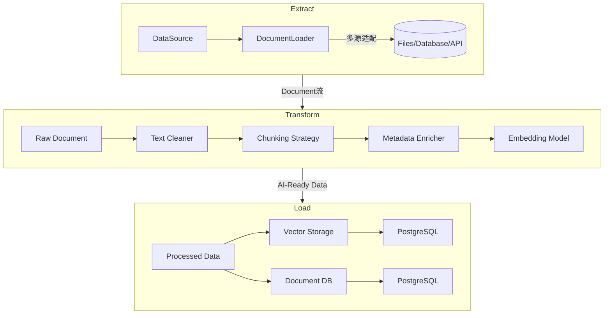
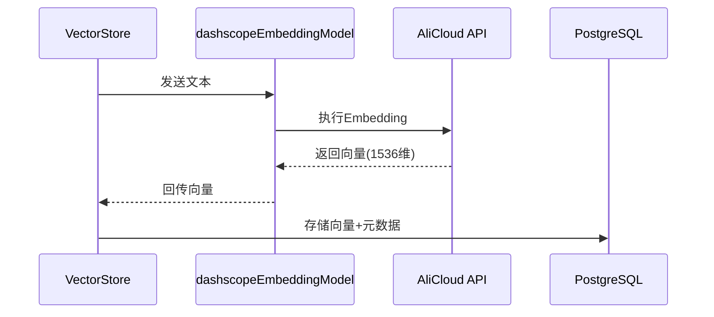

# RAG Tehnology

## 1.1 ETL

```mermaid
flowchart TB
    subgraph E[Extract]
        A[DataSource] --> B[DocumentLoader]
        B -->|多源适配| C[(Files/Database/API)]
    end
    
    subgraph T[Transform]
        D[Raw Document] --> E1[Text Cleaner]
        E1 --> E2[Chunking Strategy]
        E2 --> E3[Metadata Enricher]
        E3 --> E4[Embedding Model]
    end
    
    subgraph L[Load]
        F[Processed Data] --> G[Vector Storage]
        G --> H[PostgreSQL]
        F --> I[Document DB]
        I --> J[PostgreSQL]
    end
    
    E -->|Document流| T
    T -->|AI-Ready Data| L
    
    click B "#documentloader" _blank
    click E4 "#embedding" _blank

```

## 1.2 Embedding

```mermaid
sequenceDiagram
VectorStore->>dashscopeEmbeddingModel: 发送文本
dashscopeEmbeddingModel->>AliCloud API: 执行Embedding
AliCloud API-->>dashscopeEmbeddingModel: 返回向量(1536维)
dashscopeEmbeddingModel-->>VectorStore: 回传向量
VectorStore->>PostgreSQL: 存储向量+元数据
```
